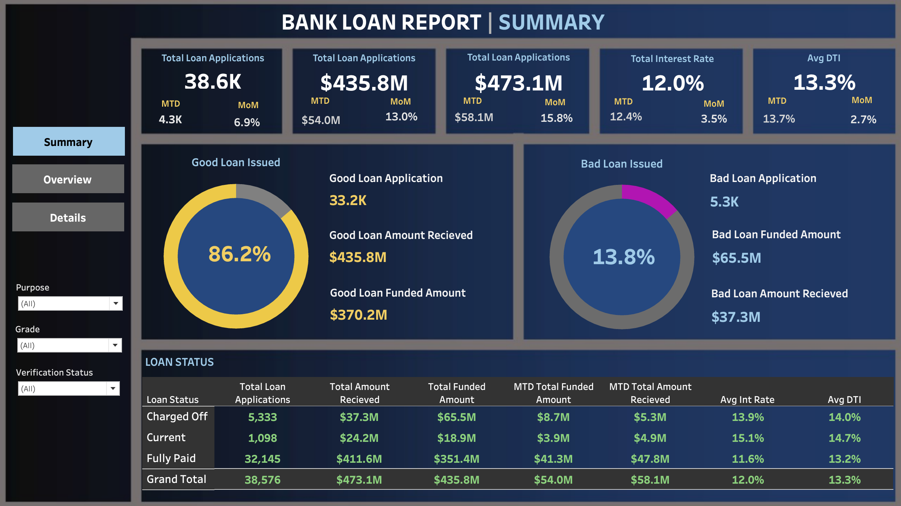

# Tableau Project: Bank Loan Report

## Problem Statement

In order to monitor and assess our bank's lending activities and performance, we need to create a comprehensive Bank Loan Report. This report aims to provide insights into key loan-related metrics and their changes over time. The report will help us make data-driven decisions, track our loan portfolio's health, and identify trends that can inform our lending strategies.

### Key Performance Indicators (KPIs) Requirements:

1. **Total Loan Applications**: Calculate the total number of loan applications received during a specified period. Additionally, monitor the Month-to-Date (MTD) Loan Applications and track changes Month-over-Month (MoM).
2. **Total Funded Amount**: Understand the total amount of funds disbursed as loans. Keep an eye on the MTD Total Funded Amount and analyze the Month-over-Month (MoM) changes in this metric.
3. **Total Amount Received**: Track the total amount received from borrowers to assess the bank's cash flow and loan repayment. Analyze the Month-to-Date (MTD) Total Amount Received and observe the Month-over-Month (MoM) changes.
4. **Average Interest Rate**: Calculate the average interest rate across all loans, MTD, and monitor the Month-over-Month (MoM) variations in interest rates to gain insights into the overall cost of the lending portfolio.
5. **Average Debt-to-Income Ratio (DTI)**: Evaluate the average DTI for borrowers to gauge their financial health. Compute the average DTI for all loans, MTD, and track Month-over-Month (MoM) fluctuations.

### Good Loan vs. Bad Loan KPIs

#### Good Loan KPIs:

1. **Good Loan Application Percentage**: Calculate the percentage of loan applications classified as 'Good Loans' (loans with a loan status of 'Fully Paid' and 'Current').
2. **Good Loan Applications**: Identify the total number of loan applications falling under the 'Good Loan' category (loans with a loan status of 'Fully Paid' and 'Current').
3. **Good Loan Funded Amount**: Determine the total amount of funds disbursed as 'Good Loans' (principal amounts of loans with a loan status of 'Fully Paid' and 'Current').
4. **Good Loan Total Received Amount**: Track the total amount received from borrowers for 'Good Loans' (payments made on loans with a loan status of 'Fully Paid' and 'Current').

#### Bad Loan KPIs:

1. **Bad Loan Application Percentage**: Calculate the percentage of loan applications categorized as 'Bad Loans' (loans with a loan status of 'Charged Off').
2. **Bad Loan Applications**: Identify the total number of loan applications categorized as 'Bad Loans' (loans with a loan status of 'Charged Off').
3. **Bad Loan Funded Amount**: Determine the total amount of funds disbursed as 'Bad Loans' (principal amounts of loans with a loan status of 'Charged Off').
4. **Bad Loan Total Received Amount**: Track the total amount received from borrowers for 'Bad Loans' (payments made on loans with a loan status of 'Charged Off').

### Loan Status Grid View

To gain a comprehensive overview of our lending operations and monitor the performance of loans, we aim to create a grid view report categorized by 'Loan Status.' This report will serve as a valuable tool for analyzing and understanding key indicators associated with different loan statuses. By providing insights into metrics such as 'Total Loan Applications,' 'Total Funded Amount,' 'Total Amount Received,' 'Month-to-Date (MTD) Funded Amount,' 'MTD Amount Received,' 'Average Interest Rate,' and 'Average Debt-to-Income Ratio (DTI),' this grid view will empower us to make data-driven decisions and assess the health of our loan portfolio.

---

## Table of Contents

- [Screenshots](#screenshots)
- [Getting Started](#getting-started)
- [Dashboard Descriptions](#dashboard-descriptions)
  - [Dashboard 1: Summary](#dashboard-1-summary)
  - [Dashboard 2: Overview](#dashboard-2-overview)
  - [Dashboard 3: Details](#dashboard-3-details)
- [Dependencies](#dependencies)
- [Built With](#built-with)
- [Author](#author)

## Screenshots

&nbsp;

&nbsp;

## Getting Started

To explore the Bank Loan Report project in Tableau, follow these steps:

1. Clone the repository to your local machine.
2. Open the Tableau workbook file (`Bank_Loan_Report.twb`) using Tableau Desktop.
3. Navigate through the dashboards to view and interact with the visualizations.

## Dashboard Descriptions

### Dashboard 1: Summary

The Summary dashboard provides an overview of key performance indicators (KPIs) related to our bank's lending activities. This includes:

- **Total Loan Applications and trends (MTD and MoM)**: Tracks the number of loan applications received and compares month-to-date (MTD) figures with month-over-month (MoM) trends.
- **Total Funded Amount and its variations (MTD and MoM)**: Measures the total funds disbursed as loans, including MTD and MoM variations.
- **Total Amount Received from borrowers (MTD and MoM)**: Monitors the total repayments received from borrowers, with MTD and MoM comparisons.
- **Average Interest Rate across all loans (MTD and MoM)**: Calculates the average interest rate for all loans, highlighting MTD and MoM changes.
- **Average Debt-to-Income Ratio (DTI) of borrowers (MTD and MoM)**: Evaluates the financial health of borrowers by computing the average DTI ratio, along with MTD and MoM fluctuations.

### Dashboard 2: Overview

The Overview dashboard presents critical loan-related metrics using various chart types:

1. **Monthly Trends by Issue Date (Line Chart)**:
   - **Chart Type**: Line Chart
   - **Metrics**: 'Total Loan Applications,' 'Total Funded Amount,' and 'Total Amount Received'
   - **X-Axis**: Month (based on 'Issue Date')
   - **Y-Axis**: Metrics' Values
   - **Objective**: This line chart will showcase how 'Total Loan Applications,' 'Total Funded Amount,' and 'Total Amount Received' vary over time, allowing us to identify seasonality and long-term trends in lending activities.

2. **Regional Analysis by State (Filled Map)**:
   - **Chart Type**: Filled Map
   - **Metrics**: 'Total Loan Applications,' 'Total Funded Amount,' and 'Total Amount Received'
   - **Geographic Regions**: States
   - **Objective**: This filled map will visually represent lending metrics categorized by state, enabling us to identify regions with significant lending activity and assess regional disparities.

3. **Loan Term Analysis (Donut Chart)**:
   - **Chart Type**: Donut Chart
   - **Metrics**: 'Total Loan Applications,' 'Total Funded Amount,' and 'Total Amount Received'
   - **Segments**: Loan Terms (e.g., 36 months, 60 months)
   - **Objective**: This donut chart will depict loan statistics based on different loan terms, allowing us to understand the distribution of loans across various term lengths.

4. **Employee Length Analysis (Bar Chart)**:
   - **Chart Type**: Bar Chart
   - **Metrics**: 'Total Loan Applications,' 'Total Funded Amount,' and 'Total Amount Received'
   - **X-Axis**: Employee Length Categories (e.g., 1 year, 5 years, 10+ years)
   - **Y-Axis**: Metrics' Values
   - **Objective**: This bar chart will illustrate how lending metrics are distributed among borrowers with different employment lengths, helping us assess the impact of employment history on loan applications.

5. **Loan Purpose Breakdown (Bar Chart)**:
   - **Chart Type**: Bar Chart
   - **Metrics**: 'Total Loan Applications,' 'Total Funded Amount,' and 'Total Amount Received'
   - **X-Axis**: Loan Purpose Categories (e.g., debt consolidation, credit card refinancing)
   - **Y-Axis**: Metrics' Values
   - **Objective**: This bar chart will provide a visual breakdown of loan metrics based on the stated purposes of loans, aiding in the understanding of the primary reasons borrowers seek financing.

6. **Home Ownership Analysis (Tree Map)**:
   - **Chart Type**: Tree Map
   - **Metrics**: 'Total Loan Applications,' 'Total Funded Amount,' and 'Total Amount Received'
   - **Hierarchy**: Home Ownership Categories (e.g., own, rent, mortgage)
   - **Objective**: This tree map will display loan metrics categorized by different home ownership statuses, allowing for a hierarchical view of how home ownership impacts loan applications and disbursements.

### Dashboard 3: Details

The Details dashboard provides a comprehensive view of essential loan data points and metrics, including borrower profiles and loan performance indicators. This dashboard serves as a one-stop solution for accessing vital loan data and making informed decisions based on detailed insights.

## Dependencies

- Tableau Desktop
- Bank loan data files (`financial_loan.csv`)

## Built With

- Tableau Desktop
- PostgreSQL database (for data storage and retrieval)

## Author

- Naman Modi
